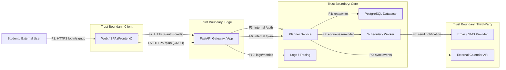

# DFD — Data Flow Diagram (Study Planner)

## Диаграмма

## Потоки данных

| ID  | Откуда → Куда | Протокол / Канал | Данные / PII | Комментарий |
|-----|----------------|------------------|---------------|--------------|
| F1  | User → SPA | HTTPS | email, пароль | Первичный вход / регистрация |
| F2  | SPA → Gateway (/auth) | HTTPS | creds / session | Передача учётных данных |
| F3  | Gateway → Planner Service (/auth) | mTLS / internal API | session claims | Проверка логина |
| F4  | Planner Service → DB | TCP (TLS) | расписание, PII | CRUD над задачами |
| F5  | SPA → Gateway (/plan) | HTTPS | расписание | Основное API |
| F6  | Gateway → Planner Service (/plan) | internal RPC | расписание | Вызов бизнес-логики |
| F7  | Planner Service → Scheduler | Queue / AMQP | job payload | Постановка напоминания |
| F8  | Scheduler → Mail Provider | HTTPS (API key) | email / phone | Отправка уведомления |
| F9  | Planner Service → Calendar API | HTTPS (API key) | события | Синхронизация календаря |
| F10 | Gateway → Logs / Tracing | HTTPS / TCP | correlation_id, метаданные | Централизованные логи |
